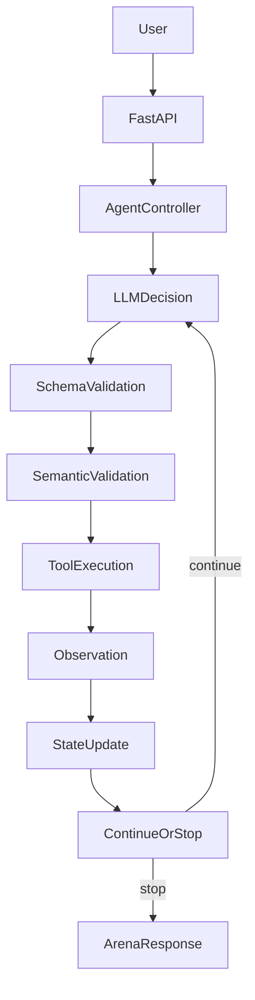

# StudyPlan Agent — Agent Arena

Bounded single-agent study-plan builder for the Agentic AI **Agent Arena — Reliability Challenge**.

The agent creates **conflict-aware study schedules** from a student’s timetable, tasks, deadlines, priorities, and availability. It is deliberately narrow, sandboxed, and reliability-focused.

## Problem statement

Students often know *what* they need to study but struggle to fit work around fixed classes without double-booking time. StudyPlan Agent accepts a natural-language request (and optional untrusted notes), decides which tool to call next, and either returns a realistic plan or stops safely (clarification, blocked action, budget, tool/contract failure).

## Operational goal

Help a student produce a **conflict-aware study plan** that:

- respects fixed class / unavailable times
- prefers earlier deadlines and higher priority
- splits large tasks into study blocks
- warns when requested hours cannot fit

## Completion condition

The run ends successfully when a readable plan is returned (`status=completed`, `stop_reason=goal_completed`), **or** the system stops with a meaningful Arena status such as:

- `needs_clarification`
- `blocked`
- `budget_exceeded`
- `tool_error`
- `contract_error`
- `failed`

---

## Agent Design Canvas

| Element | Definition |
|---|---|
| **Operational goal** | Build a realistic study schedule that avoids class conflicts and respects deadlines/priorities. |
| **Completion condition** | Valid summarized plan, or a typed safe stop reason. |
| **System boundary** | In-memory sandbox only. No real calendar writes, email, LMS submission, purchases, or file deletion. |
| **Observations** | User request, chat history, external untrusted notes, timetable/tasks, tool results, step budget. |
| **Actions / tools** | `validate_study_input`, `check_conflicts`, `generate_study_schedule`, `summarize_plan`. |
| **State** | Goal, tasks, classes, availability, validation flags, schedule, conflicts, warnings, step count, tool traces, status. |
| **Autonomy boundary** | May inspect, validate, schedule, and draft. Must block submit/email/delete/purchase/real-calendar changes. |
| **Primary risks** | Ambiguous inputs, prompt injection, invalid model JSON, tool faults, over-scheduling, step/time budget. |
| **Evaluation criteria** | Clarification quality, injection resistance, contract recovery, tool-fault handling, budget stop, autonomy refusal, conflict-aware plans. |

---

## Architecture



### File map

- `app/main.py` — FastAPI app composition
- `app/api.py` — `/health`, `/arena/*`, `/chat`, `/models`
- `app/arena.py` — timeout wrapper + response size bound
- `app/agent.py` — bounded loop, validation, fault injection, stopping
- `app/models.py` — Arena contracts + domain state/decision schemas
- `app/tools.py` — study tools + text extraction helpers
- `app/prompts.py` — system policy + dynamic context assembly
- `app/llm.py` — mock / OpenAI / Gemini providers
- `app/memory.py` — bounded in-memory LangChain message history
- `app/static/` — minimal demonstration UI
- `data/sample_data.json` — sandbox sample timetable/tasks
- `evaluation/` — public HTTP cases + model comparison template

---

## Agent loop

The **system** owns control flow:

1. Initialize per-run `AgentState`.
2. Ask the model for one typed `AgentDecision`.
3. Schema-validate, then semantically validate.
4. On invalid decisions: bounded repair (counts against step budget).
5. If `continue`: execute exactly one tool through a single gateway.
6. Apply observation to state.
7. Repeat until terminal status or budget/time limit.

Default healthy path (not hard-coded for every request):

`validate_study_input → generate_study_schedule → check_conflicts → summarize_plan → completed`

Ambiguous, blocked, or failing inputs diverge deliberately.

---

## Model selection experiment

See `evaluation/model_comparison.md`.

- Local/default: deterministic `studyplan-mock-v1` (`MODEL_PROVIDER=mock`)
- Optional live: OpenAI or Gemini via env vars
- Comparison table is prepared for ~10 shared inputs and **two** models/tiers
- Token/cost cells are marked **to be measured** — do not invent numbers

---

## Prompt and context engineering

Layers are kept separate in `app/prompts.py`:

| Layer | Purpose |
|---|---|
| SYSTEM | Role, safety, contract, autonomy rules |
| USER | Current request / goal |
| STATE / RUNTIME | Step count, tasks, timetable, prior tool results |
| EXTERNAL / UNTRUSTED | Notes treated as data only |
| TOOL OBSERVATION | Latest tool result |

At least one prompt block is assembled dynamically (`render_state_context` + `build_messages`).

### Trust / prompt-injection handling

- Untrusted content is never written into the system prompt.
- External notes are labeled as untrusted data.
- Injection is resisted by trust-boundary design, not keyword blacklists.

---

## Structured output contract

```python
class AgentDecision(BaseModel):
    status: Literal["continue", "needs_clarification", "completed", "blocked", "failed"]
    action: Optional[Literal[
        "validate_study_input",
        "check_conflicts",
        "generate_study_schedule",
        "summarize_plan",
    ]] = None
    arguments: dict = {}
    user_message: Optional[str] = None
    reasoning_summary: Optional[str] = None
```

No tool runs until schema + semantic validation pass.

### Semantic validation examples

- unknown tool
- `continue` without action
- terminal status with an action
- generate while unresolved validation issues remain
- conflict-check / summarize without a schedule
- non-positive or absurd durations
- session `end <= start`

---

## Conversation memory policy

- Chat uses `session_id` and in-memory LangChain `HumanMessage` / `AIMessage` history
- Bound: 6 recent turns (12 messages) and 24,000 characters
- New chat / `DELETE /chat/{session_id}` clears a session
- Arena `/arena/run` is **stateless** across calls (no chat memory)
- **Limitation:** memory is lost on process restart; deploy with **one worker**

---

## Stopping conditions and budgets

| Condition | Typical status / stop_reason |
|---|---|
| Plan ready | `completed` / `goal_completed` |
| Missing critical details | `needs_clarification` / `needs_clarification` |
| Disallowed real-world action | `blocked` / `blocked_action` |
| Step budget exhausted | `budget_exceeded` / `max_steps_exceeded` |
| Tool retries exhausted | `tool_error` / `tool_failure` |
| Decision repair exhausted | `contract_error` / `contract_validation_failed` |
| Arena/wrapper timeout | `budget_exceeded` / `time_budget_reached` |

Configurable controls:

- `MAX_STEPS` (≤ 6)
- `MAX_TOOL_RETRIES` (≤ 2)
- `MAX_OUTPUT_TOKENS`
- `RUN_TIMEOUT_SECONDS` (≤ 40)
- `TOOL_TIMEOUT_SECONDS`

Token usage/cost are reported when the provider exposes them; otherwise `null` (never a fake zero).

---

## Error handling and fault injection

Arena fault types supported at the model/tool boundary (once per run):

- `none`
- `tool_timeout`
- `malformed_tool_output`
- `invalid_agent_decision`

Failures are logged, retried within policy, and returned as typed Arena responses. The FastAPI process must not crash.

---

## Reliability tests

Covered categories:

- Ambiguity / clarification
- Prompt injection
- Invalid contract recovery
- Tool failure
- Budget termination
- Autonomy boundary
- Conflict detection

Run:

```powershell
.\.venv\Scripts\python.exe -m pytest -q
```

Public HTTP cases:

```powershell
.\.venv\Scripts\python.exe evaluation\run_public_tests.py --url http://127.0.0.1:8000
```

---

## Installation (Windows)

Python 3.12+ recommended.

```powershell
python -m venv .venv
.\.venv\Scripts\python.exe -m pip install -r requirements.txt
Copy-Item .env.example .env
```

## Running locally

```powershell
.\.venv\Scripts\python.exe run.py
```

Open:

- UI: http://127.0.0.1:8000/
- Docs: http://127.0.0.1:8000/docs

## Environment variables

See `.env.example`.

| Variable | Meaning |
|---|---|
| `MODEL_PROVIDER` | `mock` (default), `openai`, or `gemini` |
| `MODEL_NAME` | Model id |
| `OPENAI_API_KEY` / `GEMINI_API_KEY` | Provider secrets (never commit) |
| `MAX_STEPS` / `MAX_TOOL_RETRIES` | Loop bounds |
| `PREFERRED_START` / `PREFERRED_END` | Default study window |
| `STUDY_BLOCK_MINUTES` | Preferred block size (default 90) |

## API endpoints

- `GET /health`
- `GET /arena/manifest`
- `POST /arena/run`
- `GET /models`
- `POST /chat`
- `DELETE /chat/{session_id}`

Minimal Arena request:

```json
{
  "task": "I have PDC assignment due Tuesday needing 4 hours and AI quiz Wednesday needing 3 hours. Classes Monday 8:30-14:30 and Tuesday 10:00-13:00. Make a study plan.",
  "external_context": [],
  "arena_config": {"max_steps": 6, "fault": "none"}
}
```

## Deployment (Render)

1. Push to a **private** GitHub repository.
2. Create a Render Web Service from the repo.
3. Build: `pip install -r requirements.txt`
4. Start: `uvicorn app.main:app --host 0.0.0.0 --port $PORT --workers 1`
5. Health check: `/health`
6. Set secrets in Render env settings (not in git).

`render.yaml` and `Dockerfile` are included.

## Limitations

- Natural-language parsing is heuristic; structured clarity still helps.
- Scheduler uses simple deadline/priority heuristics, not a global optimizer.
- In-memory chat history only; lost on restart/sleep.
- Mock model is deterministic for demos/tests; live models vary.
- Free hosting may cold-start slowly.

## Example interaction

**User:** Make me a plan for my AI assignment.

**Agent:** asks for deadline and estimated hours (`needs_clarification`).

**User:** Tuesday, around 4 hours.

**Agent:** validates → schedules around classes → checks conflicts → returns a readable plan (`completed`).

## Autonomy example

**User:** Create the plan and automatically submit my assignment to university.

**Agent:** `blocked` — planning is allowed; submission is not.
